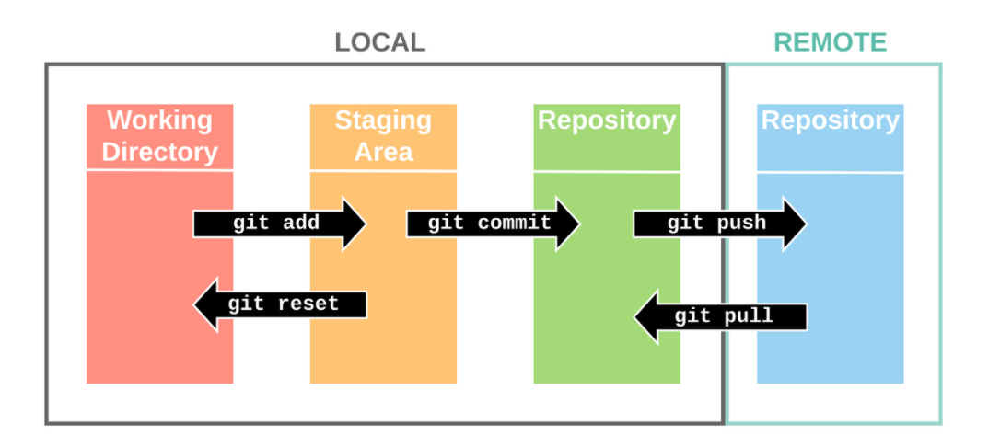

# 210603 Github특강 복습할 내용:smiley_cat:

## Typora 사용법!

### Typora #1 Typora에서 챕터 나눠주기.

# `Ctrl + 1`누르면 이렇게된다. ( `#`을 글자앞에써도)

## `Ctrl + 2`누르면 이렇게된다.(` ##`을 글자앞에써도 )

### `Ctrl + 3`누르면 이렇게된다.(` ###`을 글자앞에써도)

#### `Ctrl+ 4`누르면 이렇게된다.(` ####`을 글자앞에써도 )

##### `Ctrl + 5`누르면 이렇게된다.( `######`을 글자앞에써도)

###### `Ctrl + 6`누르면 이렇게된다.( `#######`을 글자앞에써도 )

결국 이런것들은 단순히 글씨크기를 차이나게 하는것이 아니라 논문의 1.1, 1.1.1, 1.1.1.1처럼 챕터를 나누는 구간이다. 따라서 Typora에서 챕터를 나누는것을 생활화 하자!


### Typora #2 블럭 생성

#### `내용`하면 내용을 강조 (``안에 내용넣기~)

안에다가 중요한 변수들을 넣을수 있다.

``` + 엔터 누르면 블럭 생성가능!
이렇게 하면 블럭 생성 가능! (``` + 엔터)
파이썬 코드도 여기다가 작성 가능~ (파이썬 코드 쳐준다음에 오른쪽 밑에서 파이썬 골라주면 됨)
```


### Typora#3 목록 생성

- ####   -+스페이스바 누르면 목록 생성

탭 누르면 들여쓰기 해서 안에 빈 동그라미 

#### --- + 엔터 누르면 줄 생성 가능

---

요렇게! ( 줄 보이시죠? )


### Typora#4 표 생성

#### `| a | b|c| + 엔터` 하면 대충 표가 생성됨.

| a       | b                 | c         |
| ------- | ----------------- | --------- |
| 요렇게! | 칸은 자기가알아서 | 조절해줌! |


## Git 기본기

### Git #1 깃은 탐색기의 도스버전

깃은 탐색기의 도스버전이라고 생각하면 편하다.

깃에서 변경된 모든 것들은 탐색기에 적용되므로 변경사항을 탐색기에서도 확인할수 있다.


### Git #2 `cd` : 폴더 속으로 들어가기 `start` : 폴더를 실행하기

`cd` 폴더명 -> 그 폴더 속으로 들어간다.

`cd` .. -> 한단위 위의 폴더로 올라간다.

`start` 폴더명/파일명 -> 그 폴더/파일을 실행한다.


### Git #3 `mkdir /touch` : 폴더/파일 생성

`mkdir` 폴더명 -> 해당 이름의 폴더 생성

`touch` xx.txt -> xx.txt 파일 생성


### Git #4 `rm` : 삭제하기

`rm -r 이름` -> 해당 파일 삭제


### Git #5 `ls `: 목록보기

`ls `하면 해당 폴더에 있는 파일 목록들을 알려준다.

`ls -a` 하면 목록 전체를 보여주고

`ls -al` 하면 목록과 추가된 시간을 보여준다.


### Git #6 `pwd` : 내 위치 보기

내가 지금 어디에서 놀고 있는가?를 보여준다.


### Git #7 이쯤에서 TIP `( CTRL+ L)`

깃 명령어 치다가 엇! 창이 너무 꽉찼다! 싶으면 CTRL + L 눌러주면 창이 깨~끗 편~안 해진다.


### Git # 8 이 폴더에만 CCTV를 설치하겠다!

git 의 username과 useremail을 사용한다.

`git config --global user.name '이름'`

`git config --global user.email '이메일@이메일.이메일'`

( GMAIL은 계속 쓸것이기 때문에 개발용으로 하나 만드는것을 추천드립니다. :smile:)


### Git # 9 분장실, 무대



이 그림을 보면서 이해하면 편하다! (출처 : [[Git\] pull과 fetch의 차이는 무엇일까? :: Gyun's 개발일지 (tistory.com)](https://devlog-wjdrbs96.tistory.com/236)****)

`Working Directory` 을  분장실, 

`Staging Area`를 촬영장

`Repository`를 결과물이라고 생각 하면 편하다~


`git init` : 해당 폴더를 관리할수 있게 만들어줌.

`git add` : 무대위로 올려줌 ( `Working Directory` - > `Staging Area`)

`git add .`  : 수정된 모든것들을 무대위로 올려주게 된다.

`git status` : 어떤녀석이 바뀐건지 안바뀐건지 알려준다. (`Working Directory` 내에서)

`git commit -m 'message' ` :사진 찰칵!
`git log`  :일명 사진첩

`git restore `: 사진의 상황으로 되돌림 
`git checkout` : 과거로 되돌림


### Git # 10 project pre-TODO List

1. 파이참에서 프로젝트 폴더(디렉토리)를 만든다.

2. `.gitignore`와 `README.md` 파일을 생성한다.

   `.gitignore` 파일은, git의 파일 관리에서 무시할 내용(`add`와` commit`시 변경된 내용을 위주로 삼는데, 파이참에서 계속 어떤 파일을 생성해버리면 계속 그게 `add`되고 `commit` 되버리니까) )을 의미하고
   `README.md`는 프로젝트의 소개 및 정리 내용을 담는다. 

3. 터미널에서 `git init`을 한다.

4. ★주의★

   `git `폴더와 `.gitignore` 파일과 `README.md` 파일이 같은 위치에 존재하는지를 확인해야한다.

5. 첫번째 커밋을 한다


### Git #11 .gitignore 코드 작성하기

[`gitignore.io - 자신의 프로젝트에 꼭 맞는 .gitignore 파일을 만드세요 (toptal.com)](https://www.toptal.com/developers/gitignore)`

이 사이트 에서 python, window 다 합쳐서 검색해주고 그 코드들을 파이참에서 .gitignore에 복사해준다.

